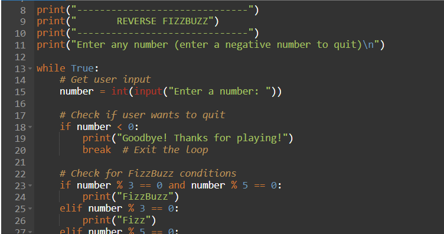

# my-portfolio
My personal portfolio website using GitHub Pages.

  

  

# Amiya Tisdol

## About Me
Hello! My name is Amiya Tisdol. I am a Psychology major at Loyola University Maryland with experience in customer service, childcare, and technology-based coursework. I enjoy learning new skills and building creative projects.

---

## Education
**B.A. in Psychology**  
Loyola University Maryland  
Expected Graduation: 2029

---

## Projects

### ⭐ Project 1: Weekly Outlook Calendar System
.
A full color-coded Microsoft Outlook school-week calendar with categorized courses and custom styling.

Initial Project Idea

The goal of this project was to build a fully organized digital school-week calendar using Microsoft Outlook. I wanted a system that clearly displayed my weekly course schedule while making it easier to manage my time, reduce confusion, and stay consistent with assignments and commitments.

Tools I Used

• Microsoft Outlook Calendar

• Color-coding categories

• School week calendar view

• Snipping tool for screenshots

Challenges I Faced

One challenge was adjusting Outlook’s settings to correctly repeat each class on the right days. I also had to test several color combinations before finding a system that made each course easy to distinguish at a glance. Understanding how to switch to “School Week” view required some trial and error.

Other Resources

I used my official course schedule, help from AI guidance, and Outlook’s built-in tutorials. I did not collaborate with classmates on this project.

Result

I successfully created a visually clear, organized calendar showing all five weekly classes and a special event. Each class is color-coded, repeated automatically, and displayed in school-week format for easy planning. If I expanded this project, I would add reminders, assignment deadlines, and more automated categories.

Summary (25–35 words)

This project organized my weekly class schedule using Outlook Calendar with repeating events, color coding, and school-week formatting. It helps manage time effectively and visually simplifies my academic workload.
---

### ⭐ Project 2: Excel Inventory Manager & Budget Tracker
[Excel Inventory Manager](https://1drv.ms/x/c/3f7e62bf4d7a61d2/EYzK65sTEJhIvFskx6e8mWwBMc9PpIYcv-Li7aHAuFwGvg?e=WE36Mv)
Inventory system and financial tracker using formulas, conditional formatting, data tables, and multiple worksheets.

 Initial Project Idea

I created an Excel-based Inventory Manager for my thrift clothing business idea. My goal was to organize items, analyze profit margins, and understand how pricing affected my potential side-hustle revenue. This problem mattered because managing inventory manually can lead to errors and unclear profit expectations.

 Tools I Used

Microsoft Excel (multi-worksheet workbook)

Formulas: SUM, AVERAGE, MAX, MIN, COUNT

Conditional formatting

Comments, merged cells, borders, color-coding, data tables

Additional worksheet for a Budget Tracker

 Challenges I Faced

I struggled with designing formulas, especially profit margin equations and mixed cell references. I also had difficulty color-coding categories and formatting the table so it looked clean and easy to read. Through trial, error, and reference examples, I overcame these issues and created a polished workbook.

 Other Resources

I used class notes, trial-and-error support from Excel’s formula helper, and instructor guidance for mixed/absolute referencing and conditional formatting. I also reviewed online examples of inventory spreadsheets for layout inspiration.

 Result

I created a complete inventory system with automatic profit calculations, visual indicators, and clean formatting. My budget tracker sheet lets me monitor my income, expenses, and savings goals. If I expanded this project, I would add dynamic charts, a dashboard, and pivot tables to analyze trends.

 25–35 Word Project Summary

A multi-worksheet Excel workbook analyzing thrift inventory using formulas, conditional formatting, and data visualization. Includes profit calculations, category color-coding, and a customized budget tracker to organize income, expenses, and savings goals.
---

### ⭐ Project 3: Reverse FizzBuzz Program (Python)
[Reverse Fizz Buzz Program](https://onlinegdb.com/rgwHqkDr21)
A Python program using loops and conditionals to evaluate multiples of numbers until the user exits the program.

 Initial Project Idea

I created a Reverse FizzBuzz program to practice conditional logic, loops, user input, and error handling in Python. The problem I set out to solve was making a simple program that repeatedly evaluates whether a number is "Fizz," "Buzz," "FizzBuzz," or neither. This allowed me to apply core programming concepts we learned in class.

 Tools I Used

Python 3

JDoodle / OnlineGDB (for writing, running, testing code)

While loops

If / elif / else decision logic

Input validation handling

Print statements for clean user feedback

 Challenges I Faced

The biggest challenge was structuring the loop so the program continues to ask for new numbers until the user enters a negative value. I also needed to understand how the order of conditions affects correct output—specifically checking for multiples of both 3 and 5 before checking for each individually. After testing and debugging, the logic flowed correctly.

 Other Resources

I referred to class lecture notes on loops and conditional statements. I also used JDoodle’s error messages to fix mistakes. No external libraries or collaboration were needed — the project was coded independently using introductory Python tools.

 Result

The final program successfully evaluates numbers, identifies Fizz/Buzz/FizzBuzz conditions, handles invalid answers, and loops until the user quits with a negative number. If I expanded it, I would add color output, a menu, or a graphical interface.

 25–35 Word Project Summary

A Python program that uses loops, user input, and conditional logic to evaluate numbers as Fizz, Buzz, or FizzBuzz. Includes input validation and repeats until the user exits with a negative value.
